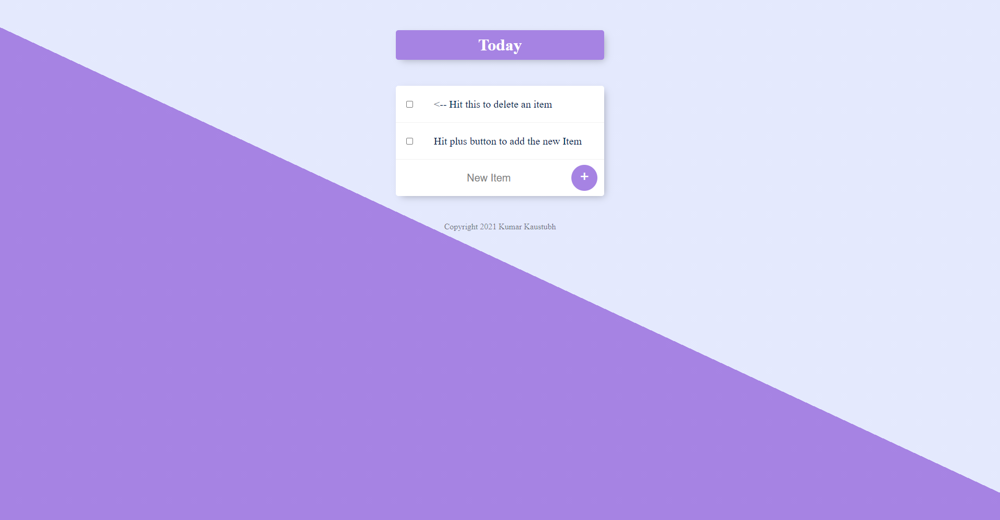

# Web-Development (To-Do List Web App)
This is a todolist project from Angela Yu's complete bootcamp.

Using EJS, Express and Node.js 

I have implemented some changes in this according to my choice so it's not the same as the instructor taught in the course.

**Website Image**

[Visit Website](https://todo-app-03352.herokuapp.com/)
